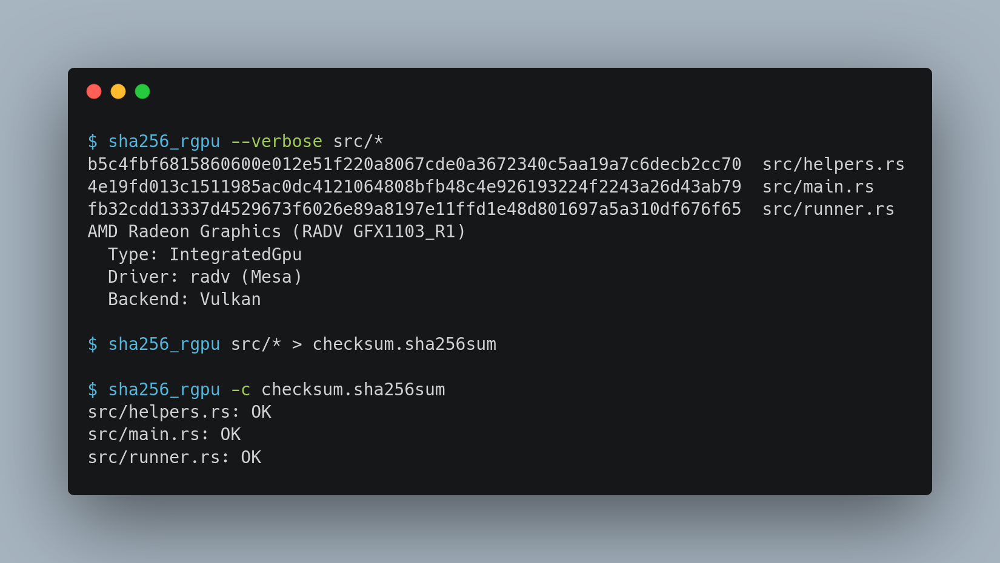

# sha256_rgpu

SHA256 Compute Shader (Kernel) Written in Rust. Aka a "hash-shader".

This project contains the following goals:
- Write Rust code for computing SHA256 on GPUs using [rust-gpu](https://github.com/EmbarkStudios/rust-gpu)
- Use [wgpu](https://github.com/gfx-rs/wgpu) for cross-platform GPU compute
- Reference implementation for writing compute kernels and WebGPU runners in Rust
- `sha256_rgpu` command-line tool for assessing data integrity, similiar to `sha256sum`

### On the web

Try at [https://rustybamboo.github.io/hash-shader/](https://rustybamboo.github.io/hash-shader/)

Note that you will need a browser that supports WebGPU. 

### Screenshot of sha256_rgpu



### Building

This code is written in Rust, so you'll need to grab a [Rust installation](https://www.rust-lang.org/learn/get-started) in order to compile it. Note that compilation of the compute kernel for GPUs requires the nightly [toolchain](./rust-toolchain), but this should automatically be installed in the following steps.

```
$ git clone https://github.com/RustyBamboo/hash-shader/
$ cd hash_shader
$ cargo build --release
$ ./target/release/sha256_rgpu --help
```


### Example: Run blockchain validator

SHA256 is a key part of the bitcoin blockchain. The following example tests the integrity of a large porition of the blockchain.

First, generate the csv file with rows as `block_header_hex,expected_hash`:

```
$ python3 examples/prepare_blockchain.py
```

Now, pass the csv file to the `blockchain_val` example.

```
$ cargo run --release --example blockchain_val block_data.csv

Validated 4998 blocks
57.035164ms + 42.468205ms = 99.503369ms
```


### Tests
This will run GPU tests:
```
cargo test --release
```             

This will run CPU tests of the kernel:
```
cd kernel
cargo test --release
```

### Code Layout

```
.
├── build.rs
├── Cargo.lock
├── Cargo.toml
├── examples
│   ├── benckmark.rs
│   ├── blockchain_val.rs
│   └── prepare_blockchain.py
├── gfx
│   └── screenshot.png
├── kernel <-- Rust code that is compiled to SPIR-V
│   ├── Cargo.lock
│   ├── Cargo.toml
│   └── src
│       └── lib.rs
├── LICENSE
├── README.md
├── rust-toolchain
├── src
│   ├── helpers.rs
│   ├── main.rs
│   └── runner.rs
```

### C + CUDA

The [CUDA branch](https://github.com/RustyBamboo/hash-shader/tree/cuda) contains an implementation of SHA256 using the CUDA API.

### Web + wasm

```
cargo install web-pack
```

```
RUSTFLAGS=--cfg=web_sys_unstable_apis wasm-pack build --target web --out-dir=web/pkg
```

### License

Please see [LICENSE](./LICENSE)