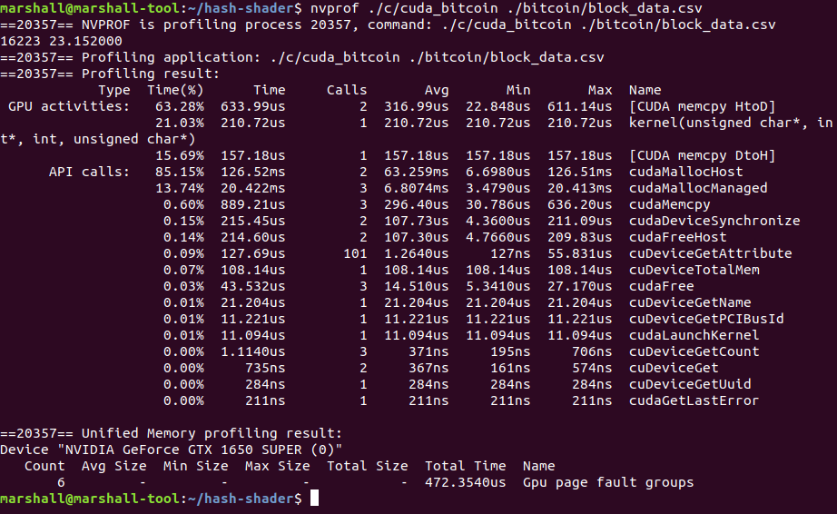
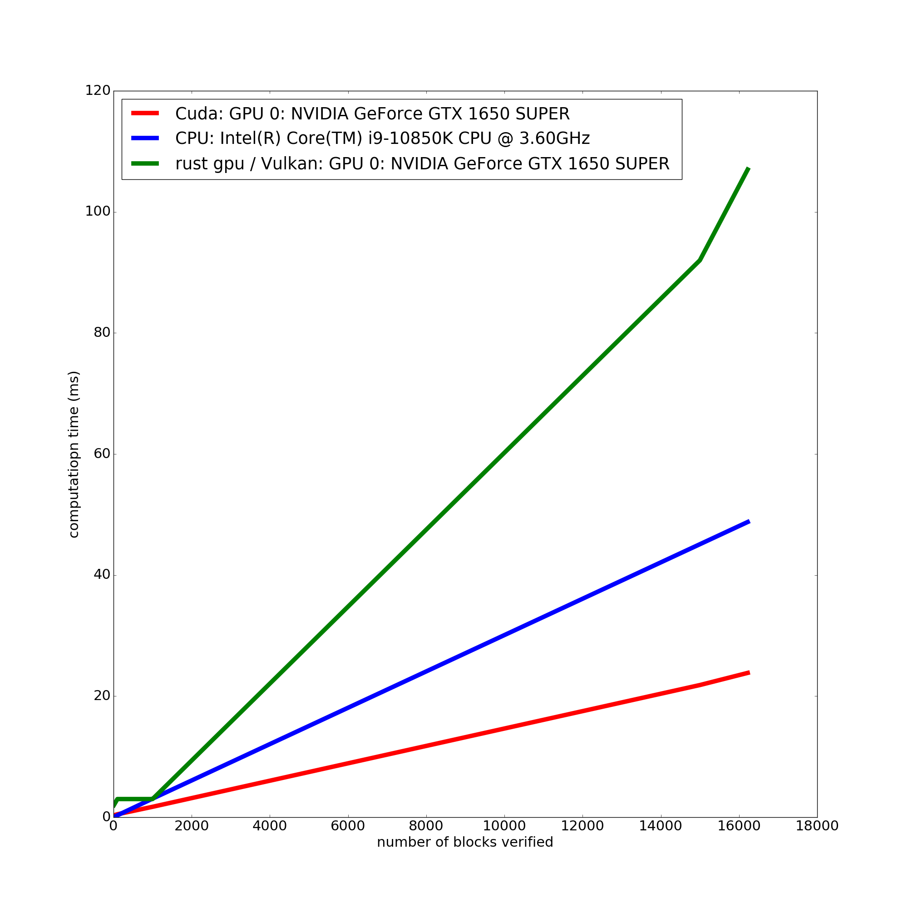

---
title:
  - Bitcoin Blockchain Validation with CUDA and Vulkan
author:
  - Daniel Volya
  - Marshall Rawson
header-includes:
 - \usepackage{fvextra}
 - \DefineVerbatimEnvironment{Highlighting}{Verbatim}{breaklines,commandchars=\\\{\}}
---

# Summary

1. What did we do?
2. Why Bitcoin Blockchain Validation?
3. Why Cuda and Vulkan?
4. How did it go?

# What did we do?

Wrote GPU kernels/shaders in Cuda(C) and Vulkan(Rust) to validate the Bitcoin Blockchain

## What is Cuda?

Nvidia implementation for uploading and running programs / data in Nvidia GPU's.

## What is Vulkan?

Open API for implementing 3D graphics and computing. Meant to replace OpenGL / Direct 3D 11.

# What is the Bitcoin Blockchain?


```
header = version + prevBlockHash + merkleRootHash + time + bits + nonce
bytes = 4 + 32 + 32 + 4 + 4 + 4 = 80
```

hash = SHA256(SHA256(header))

# Example

```
header = 01000000 81cd02ab7e569e8bcd9317e2fe99f2de44d49ab2b8851ba4a308000000000000 e320b6c2fffc8d750423db8b1eb942ae710e951ed797f7affc8892b0f1fc122b c7f5d74d f2b9441a 42a14695
```

SHA256(SHA256(header)) = 

```
1dbd981fe6985776b644b173a4d0385ddc1aa2a829688d1e0000000000000000
```

# What is SHA256?


# Why Bitcoin Blockchain validation?

## Why Blockchain validation?

* Multi block validation is very parallelizable.
* May be useful in the future.

## Why the Bitcoin Blockchain?
* Well known.
* Future Blockchain technologies will be similar.
* Easy to get data.
* Easy to port / write the code.

# Why Cuda and Vulkan? - CUDA

## Pros
* Established in the GPU programming / HPC world.
* Very well optimized
* Very well supported

# Why Cuda and Vulkan? - Vulkan


Lets us write cross-platform (compute) code using *open source* standards to interface with GPUs.

# Why Cuda and Vulkan? - Vulkan

## Pros
* Not restrict itself to any particular hardware (CPU/GPU), (AMD/Nvidia).
* Supports multiple modern languages (including Rust).
* Supports the SPIR-V.

# Vulkan

{width=200px}

# Vulkan SPIR-V

{width=250px}

# Vulkan SPIR-V


# How did it go?



# How did it go?
::: columns 

:::: column
{width=205px}
::::

:::: column
{width=205px}
::::

:::

# How did it go?

{width=250px} 

# How did it go?

## Cuda

## Cons
* Not Free Open Source Software (FOSS).
* Reliant on a profit driven organization.

## Vulkan

## Cons
* Not well established.
* SPIR-V (rust-gpu) compilers are not well optimized.
* Lack of good profilers.
