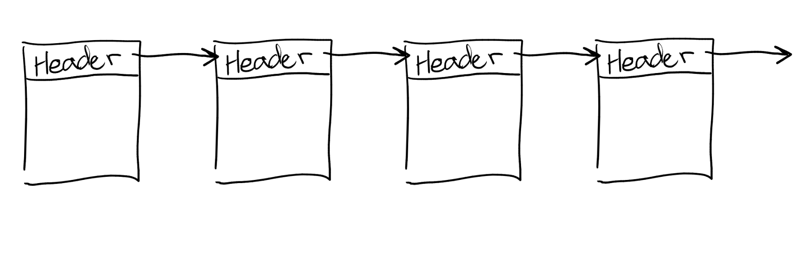
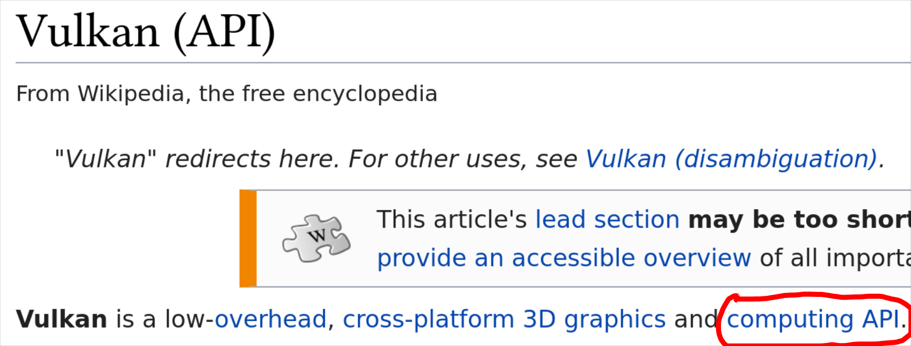
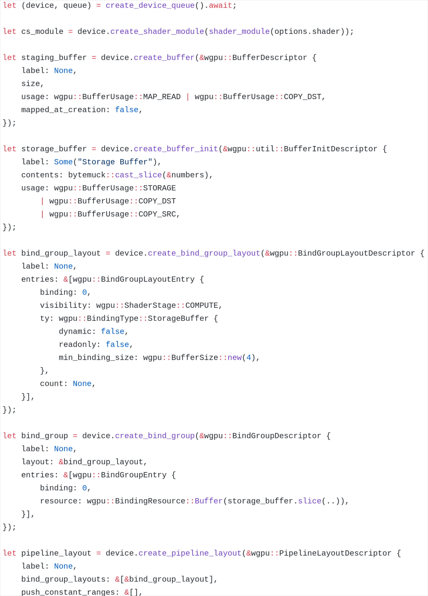
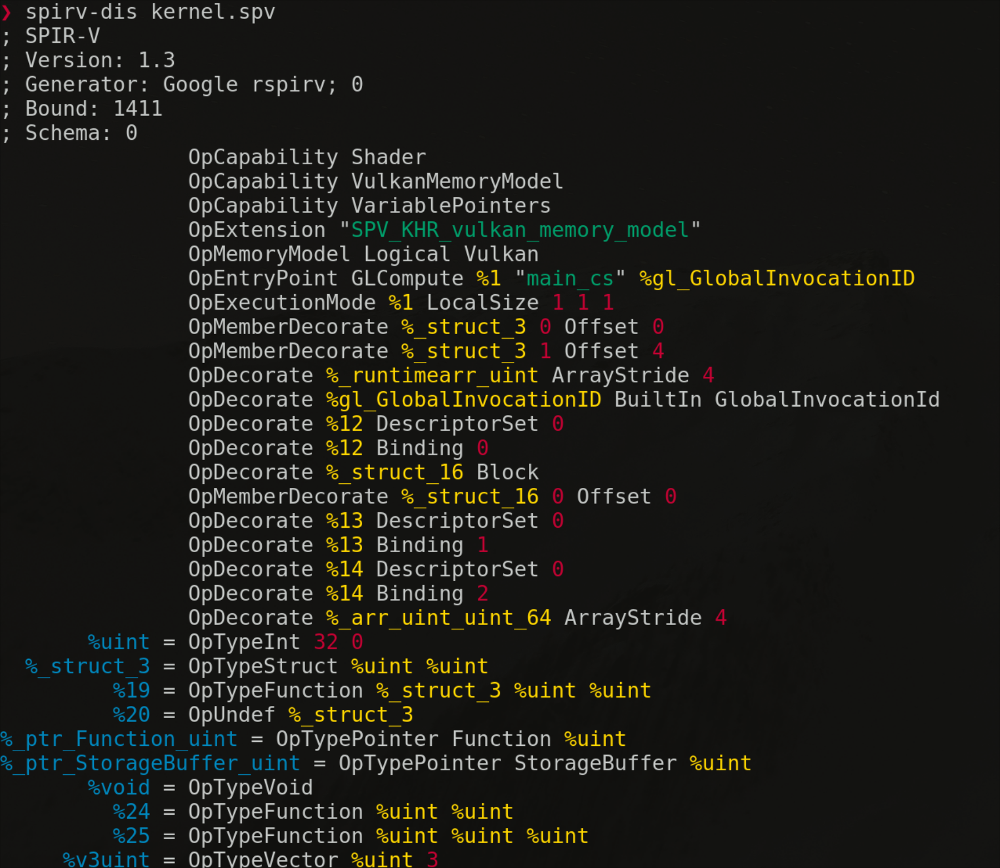
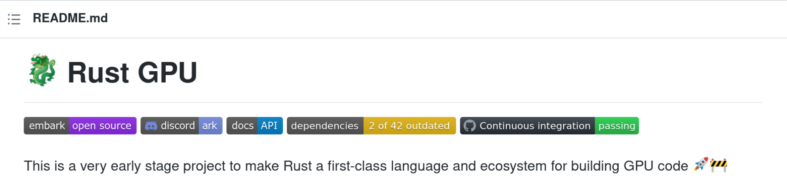
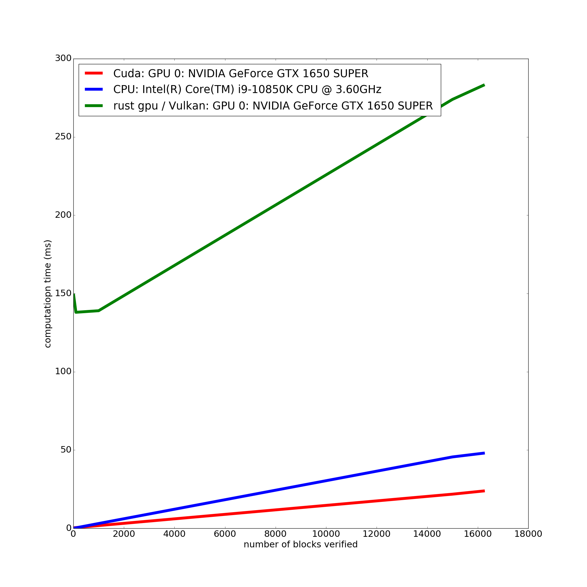
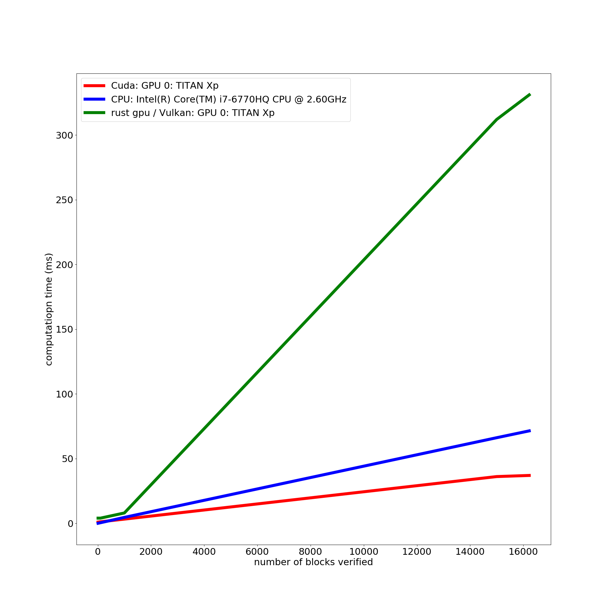

---
title:
  - Bitcoin Blockchain Validation with CUDA and Vulkan
author:
  - Daniel Volya
  - Marshall Rawson
header-includes:
 - \usepackage{fvextra}
 - \DefineVerbatimEnvironment{Highlighting}{Verbatim}{breaklines,commandchars=\\\{\}}
---

# Summary

1. What did we do?
2. Why Bitcoin Blockchain Validation?
3. Why Cuda and Vulkan?
4. How did it go?

# What did we do?

Wrote GPU kernels/shaders in Cuda(C) and Vulkan(Rust) to validate the Bitcoin Blockchain

## What is Cuda?

Nvidia implementation for uploading and running programs / data in Nvidia GPU's.

## What is Vulkan?

Open API for implementing 3D graphics and computing. Meant to replace OpenGL / Direct 3D 11.

# What is the Bitcoin Blockchain?



```
header = version + prevBlockHash + merkleRootHash + time + bits + nonce
bytes = 4 + 32 + 32 + 4 + 4 + 4 = 80
```

hash = SHA256(SHA256(header))

# Example

```
header = 01000000 81cd02ab7e569e8bcd9317e2fe99f2de44d49ab2b8851ba4a308000000000000 e320b6c2fffc8d750423db8b1eb942ae710e951ed797f7affc8892b0f1fc122b c7f5d74d f2b9441a 42a14695
```

SHA256(SHA256(header)) = 

```
1dbd981fe6985776b644b173a4d0385ddc1aa2a829688d1e0000000000000000
```

# SHA256

- Pad a message *m* to closest multiple of *512*
- Perform operations $\Sigma_0$, $\Sigma_1$, $\sigma_0$, $\sigma_1$ to create entries of message block
- Compress the message block into 8, 32bit words. Use *initial_hash* as initialization
- Add *initial_hash* to the compressed result
- Repeat until all message blocks have been hashed

# Why Bitcoin Blockchain?

## Why Blockchain Validation?

* Multi block validation is very parallelizable.
* May be useful in the future.

## Why the Bitcoin Blockchain?
* Well known.
* Future Blockchain technologies will be similar.
* Easy to get data.
* Easy to port / write the code.

# Why Cuda and Vulkan? - CUDA


## Pros
* Established in the GPU programming / HPC world.
* Very well optimized
* Very well supported

## Cons
* Not Free Open Source Software (FOSS).
* Reliant on a profit driven organization.

# Why Cuda and Vulkan? - Vulkan



Lets us write cross-platform (compute) code using *open source* standards to interface with GPUs.

# Why Cuda and Vulkan? - Vulkan

## Pros
* Not restrict itself to any particular hardware (CPU/GPU), (AMD/Nvidia).
* Supports multiple modern languages (including Rust).
* Supports the SPIR-V.

## Cons
* Not well established.
* SPIR-V (rust-gpu) compilers are not well optimized.


# Vulkan

{width=200px}

# Vulkan SPIR-V

{width=250px}

# Vulkan SPIR-V




# How Did it Go?

{width=250px}

# How Did it Go?

{width=250px} 
